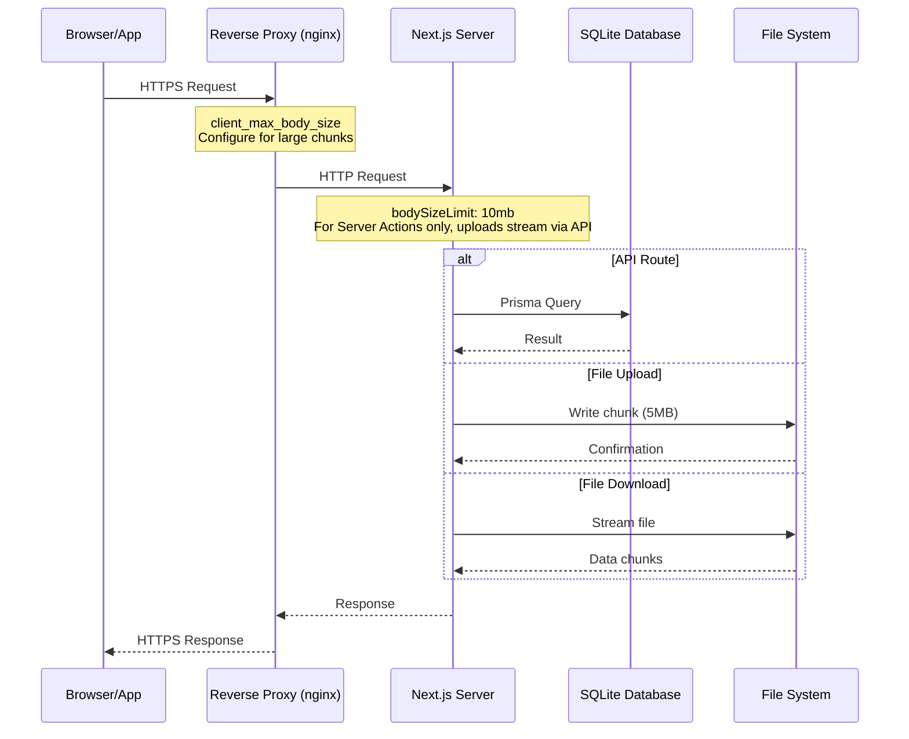

<div align="center">

# Advanced Configuration

> Understanding and tuning LinyaShare's configuration files.


</div>

---

## Navigation

| Document | Link |
|----------|------|
| Documentation Index | [docs/README.md](README.md) |
| Environment Variables | [ENVIRONMENT.md](ENVIRONMENT.md) |
| Docker Setup | [SETUP_DOCKER.md](SETUP_DOCKER.md) |

---

## Table of Contents

1. [next.config.js](#nextconfigjs)
2. [tailwind.config.ts](#tailwindconfigts)
3. [tsconfig.json](#tsconfigjson)
4. [postcss.config.js](#postcssconfigjs)
5. [Request Flow](#request-flow)
6. [Performance Tuning](#performance-tuning)

---

## next.config.js

```javascript
/** @type {import('next').NextConfig} */
const nextConfig = {
  output: 'standalone',
  experimental: {
    serverActions: {
      bodySizeLimit: '10mb',
    },
  },
}

module.exports = nextConfig
```

### output: 'standalone'

| Attribute | Value |
|-----------|-------|
| Purpose | Creates a minimal production build |
| Effect | Only includes necessary files in `.next/standalone/` |
| Benefit | Smaller Docker images, faster deployments |

> [!NOTE]
> Without `standalone` mode, the entire `node_modules` would need to be present at runtime. Standalone mode copies only the required modules, reducing the Docker image from approximately 500MB to 150MB.

### experimental.serverActions.bodySizeLimit: '10mb'

| Attribute | Value |
|-----------|-------|
| Purpose | Maximum request body size for server actions |
| Next.js Default | `1mb` |
| LinyaShare | `10mb` |

> [!NOTE]
> This setting is configured for potential Server Actions usage. **File uploads use API Routes with chunked streaming** (not Server Actions), so actual file transfers bypass this limit entirely.

#### Why 10MB?

| Reason | Explanation |
|--------|-------------|
| Server Actions support | Provides adequate space if Server Actions are used elsewhere |
| Safety margin | Small buffer above the 5MB chunk size for headers and metadata |
| Not for file uploads | Chunked uploads via `/api/upload` use streaming and are not affected by this limit |

#### When to Change

| Scenario | Recommended Value |
|----------|------------------|
| Default (API Route uploads) | `10mb` |
| Using Server Actions for uploads | Increase to match your needs |
| Behind nginx with limit | Match nginx `client_max_body_size` |
| Memory-constrained server | Keep at `10mb` or remove setting |
| No Server Actions | Remove the setting entirely |

```bash
# Check if your reverse proxy also needs updating:
# nginx: client_max_body_size 100g; (for chunked API routes)
# Caddy: Not needed (unlimited by default)
# Traefik: Not needed (unlimited by default)
```

> [!TIP]
> File uploads in LinyaShare use chunked API Routes (not Server Actions), so you still need to configure your reverse proxy for large file uploads. See the [nginx configuration in SETUP_NODEJS.md](SETUP_NODEJS.md#reverse-proxy-configuration).

---

## tailwind.config.ts

```typescript
import type { Config } from "tailwindcss"

const config: Config = {
  content: [
    "./src/**/*.{js,ts,jsx,tsx,mdx}",
  ],
  theme: {
    extend: {
      colors: {
        dark: {
          50: '#f8fafc',
          100: '#f1f5f9',
          200: '#e2e8f0',
          300: '#cbd5e1',
          400: '#94a2b8',
          500: '#64748b',
          600: '#475569',
          700: '#1e1e2e',
          800: '#11111a',
          900: '#0a0a12',
        },
        primary: {
          400: '#ec4899',
          500: '#db2777',
          600: '#be185d',
        },
      },
    },
  },
  plugins: [],
}

export default config
```

### Custom Color Palette

| Color Class | Usage |
|------------|-------|
| `dark-700` | Card backgrounds, borders |
| `dark-800` | Page background |
| `dark-900` | Deepest background layer |
| `primary-400` | Accent color (pink) |
| `primary-500` | Hover states |

> [!NOTE]
> The `dark-*` and `primary-*` colors are used throughout the app via Tailwind classes like `bg-dark-800` and `text-primary-400`.

---

## tsconfig.json

| Setting | Purpose |
|---------|---------|
| `strict: true` | Full TypeScript strict mode |
| `@/*` path alias | Import from `@/components/...` instead of relative paths |
| `bundler` module resolution | Required for Next.js 15 |
| `incremental: true` | Faster subsequent builds |

---

## postcss.config.js

```javascript
module.exports = {
  plugins: {
    tailwindcss: {},
    autoprefixer: {},
  },
}
```

Standard PostCSS configuration for Tailwind CSS. No modifications needed.

---

## Request Flow



---

## Performance Tuning

### Memory

| Setting | Default | Tuning Notes |
|---------|---------|--------------|
| `bodySizeLimit` | `10mb` | Sufficient for Server Actions, uploads use API routes |
| Chunk size | 5MB | Hard-coded in `src/lib/constants.ts` |
| Max particles | 400 | Auto-scaled in `AnimatedBackground.tsx` |

### Database

| Setting | Default | Notes |
|---------|---------|-------|
| SQLite WAL mode | Off | Enable for better concurrent performance |
| Connection pool | 1 | SQLite does not benefit from pooling |

### Network

| Component | Setting | Recommendation |
|-----------|---------|---------------|
| nginx `client_max_body_size` | `1m` | Set to `100g` for large uploads |
| nginx `proxy_read_timeout` | `60s` | Set to `300s` for slow connections |
| Cloudflare | 100MB limit | Use chunked uploads to bypass |

---

<div align="center">

[Documentation Index](README.md) | [Environment Guide](ENVIRONMENT.md) | [Database Guide](DATABASE.md)

</div>