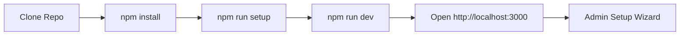

<div align="center">

# Development Guide

> Local development setup, commands, and debugging tips.


</div>

---

## Navigation

| Document | Link |
|----------|------|
| Documentation Index | [docs/README.md](README.md) |
| Environment Variables | [ENVIRONMENT.md](ENVIRONMENT.md) |
| Database Guide | [DATABASE.md](DATABASE.md) |

---

## Table of Contents

1. [Prerequisites](#prerequisites)
2. [Initial Setup](#initial-setup)
3. [Development Server](#development-server)
4. [npm Scripts Reference](#npm-scripts-reference)
5. [Database Management](#database-management)
6. [Debugging](#debugging)
7. [Troubleshooting](#troubleshooting)

---

## Prerequisites

| Tool | Version | Check Command |
|------|---------|---------------|
| Node.js | 22+ | `node --version` |
| npm | 10+ | `npm --version` |
| Git | Any | `git --version` |

> [!WARNING]
> Node.js 22 or higher is required. Older versions may not work with Next.js 15.

---

## Initial Setup



| Step | Command | Description |
|------|---------|-------------|
| 1 | `git clone https://github.com/shyskyfox/LinyaShare.git` | Clone repository |
| 2 | `cd LinyaShare` | Enter directory |
| 3 | `cp .env.example .env` | Create environment file |
| 4 | `npm install` | Install dependencies |
| 5 | `npm run setup` | Generate Prisma client and create database |
| 6 | `npm run dev` | Start development server |

> [!TIP]
> The app will be available at **http://localhost:3000**. On first visit, you will be guided through creating the admin account.

---

## Development Server

| Command | Description | Access |
|---------|-------------|--------|
| `npm run dev` | Start dev server | localhost:3000 only |
| `npm run dev:host` | Start dev server on 0.0.0.0 | Network accessible |

> [!NOTE]
> `npm run dev:host` uses `next dev -H 0.0.0.0` to bind to all network interfaces. Useful for testing on phones or tablets.

---

## npm Scripts Reference

| Script | Command | Description |
|--------|---------|-------------|
| `npm run dev` | `next dev` | Start dev server (localhost) |
| `npm run dev:host` | `next dev -H 0.0.0.0` | Start dev server (network) |
| `npm run build` | `next build` | Build for production |
| `npm start` | `node .next/standalone/server.js` | Start production server |
| `npm run start:dev` | `next start` | Start production via Next.js |
| `npm run setup` | `prisma generate + db push` | Full database setup |
| `npm run db:push` | `prisma db push` | Push schema to database |
| `npm run db:generate` | `prisma generate` | Regenerate Prisma client |
| `npm run db:studio` | `prisma studio` | Open Prisma Studio GUI |
| `npm run docker:build` | `docker compose build` | Build Docker image |
| `npm run docker:up` | `docker compose up -d` | Start Docker containers |
| `npm run docker:down` | `docker compose down` | Stop Docker containers |
| `npm run docker:logs` | `docker compose logs -f` | View Docker logs |
| `npm run docker:restart` | `docker compose restart` | Restart Docker containers |

---

## Database Management

### Prisma Studio

```bash
npm run db:studio
```

Opens a browser-based GUI at **http://localhost:5555** where you can:

| Action | Description |
|--------|-------------|
| View records | Browse all tables (User, File, Setting) |
| Edit records | Modify data directly |
| Create test data | Add users or files for testing |
| Debug issues | Inspect relationships and values |

> [!TIP]
> Prisma Studio is useful during development to quickly inspect and modify data without writing SQL.

### Schema Changes

When you modify `prisma/schema.prisma`:

| Command | Description |
|---------|-------------|
| `npm run db:push` | Apply changes to the database |
| `npm run db:generate` | Regenerate TypeScript client |

### Reset Database

```bash
# Delete the database file
rm prisma/linyashare.db

# Recreate
npm run setup
```

> [!WARNING]
> This permanently deletes all data. Only do this in development.

---

## Debugging

### Server-Side Logs

Next.js dev server outputs detailed logs to the terminal. Watch for:

| Log Type | Description |
|----------|-------------|
| API route errors | Shown with stack traces |
| Prisma queries | Visible in development mode |
| Build errors | TypeScript compilation issues |

### Client-Side Debugging

| Step | Action |
|------|--------|
| 1 | Open Browser DevTools (F12) |
| 2 | Check the Console tab for errors |
| 3 | Use the Network tab to inspect API requests |
| 4 | Use React DevTools for component inspection |

### Environment Check

```bash
# Verify your environment is set up correctly
node -e "console.log(process.version)"  # Should be 22+
npm ls next                              # Shows Next.js version
npx prisma --version                     # Shows Prisma version
```

---

## Troubleshooting

### Common Issues

| Issue | Solution |
|-------|----------|
| `Cannot find module '@prisma/client'` | Run `npm run db:generate` |
| `Port 3000 already in use` | Kill the process or use a different port |
| `Database does not exist` | Run `npm run db:push` |
| `NextAuth secret missing` | Add `NEXTAUTH_SECRET` to `.env` |
| `Upload fails with 413` | Check `bodySizeLimit` in `next.config.js` |

### Port Already in Use

```bash
# Linux/Mac
lsof -i :3000
kill -9 <PID>

# Windows
netstat -ano | findstr :3000
taskkill /PID <PID> /F
```

### Clean Reinstall

```bash
# Full clean restart
rm -rf node_modules .next
rm prisma/linyashare.db
npm install
npm run setup
npm run dev
```

---

<div align="center">

[Documentation Index](README.md) | [Environment Variables](ENVIRONMENT.md) | [Database Guide](DATABASE.md)

</div>