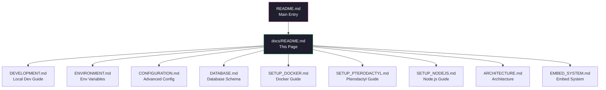
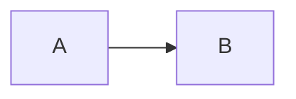

<div align="center">

# LinyaShare Documentation Wiki

> Central index for all project documentation. Use this page to navigate between guides.


</div>

---

## Document Overview



---

## Document List

| # | Document | Status | Description |
|---|----------|--------|-------------|
| 1 | [DEVELOPMENT.md](DEVELOPMENT.md) | Complete | Local development setup and commands |
| 2 | [ENVIRONMENT.md](ENVIRONMENT.md) | Complete | Environment variables reference |
| 3 | [CONFIGURATION.md](CONFIGURATION.md) | Complete | Advanced configuration and tuning |
| 4 | [DATABASE.md](DATABASE.md) | Complete | Database schema and ER diagram |
| 5 | [SETUP_DOCKER.md](SETUP_DOCKER.md) | Complete | Docker deployment guide |
| 6 | [SETUP_PTERODACTYL.md](SETUP_PTERODACTYL.md) | Complete | Pterodactyl/FeatherPanel guide |
| 7 | [SETUP_NODEJS.md](SETUP_NODEJS.md) | Complete | Node.js production guide |
| 8 | [ARCHITECTURE.md](ARCHITECTURE.md) | Complete | Project architecture overview |
| 9 | [EMBED_SYSTEM.md](EMBED_SYSTEM.md) | Complete | Media embed system docs |
| 10 | [README.md](../README.md) | Complete | Main project README |

---

## Document Conventions

All documents in this wiki follow these conventions:

### Callout Boxes

```
> [!NOTE]  
> Highlights information that users should take into account, even when skimming.

> [!IMPORTANT]  
> Crucial information necessary for users to succeed.

> [!WARNING]  
> Critical content demanding immediate user attention due to potential risks.

> [!TIP]
> Helpful advice for doing things better or more easily.

> [!CAUTION]
> Advises about risks or negative outcomes of certain actions.
```

### Code Blocks

| Language | Usage |
|----------|-------|
| `bash` | Shell commands and scripts |
| `typescript` | TypeScript code examples |
| `yaml` | Docker Compose and configuration |
| `json` | Configuration files |
| `nginx` | nginx configuration |
| `dockerfile` | Dockerfile examples |

### Mermaid Diagrams

| Diagram Type | Usage |
|-------------|-------|
| `graph` | Flowcharts and architecture |
| `sequenceDiagram` | Process flows |
| `erDiagram` | Entity relationship diagrams |
| `stateDiagram` | State machines |

---

## Maintaining This Wiki

### Adding a New Document

| Step | Action |
|------|--------|
| 1 | Create the `.md` file in the `docs/` directory |
| 2 | Add it to the Document List table in this file |
| 3 | Add a link in the main `README.md` documentation table |
| 4 | Update the Mermaid diagram in this file |

### Document Template

```markdown
<div align="center">

# Document Title

> Short description of what this document covers.


</div>

---

## Table of Contents

1. [Section 1](#section-1)
2. [Section 2](#section-2)

---

## Section 1

Content here with [links](#), `code`, and other formatting.

> [!NOTE]
> Important information callout.



### Style Guide

| Rule | Description |
|------|-------------|
| Headings | Use ATX headings (`#` style) with space after `#` |
| Links | Use descriptive link text |
| Diagrams | Use Mermaid, not images |
| Emphasis | Use callout boxes, not bold/italic alone |
| Line length | Keep under 120 characters where possible |
| Code blocks | Use fenced code blocks with language identifiers |

---

## Quick Links

| Resource | Link |
|----------|------|
| Project Repository | [github.com/shyskyfox/LinyaShare](https://github.com/shyskyfox/LinyaShare) |
| Issue Tracker | [GitHub Issues](https://github.com/shyskyfox/LinyaShare/issues) |
| Main README | [README.md](../README.md) |
| Egg File | [egg-linyashare.json](../egg-linyashare.json) |

---

<div align="center">

[Main README](../README.md) | [Development Guide](DEVELOPMENT.md) | [Docker Setup](SETUP_DOCKER.md)

Last updated: 2026-07-12

</div>